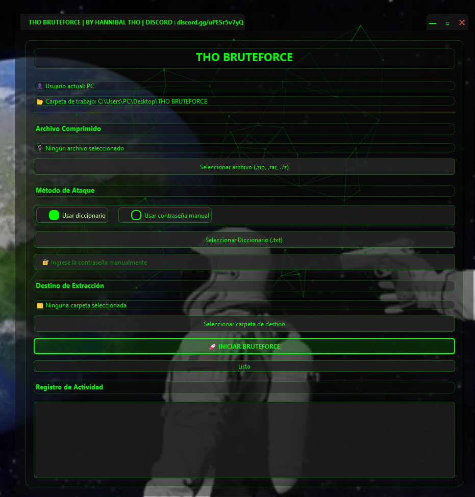

# THO BRUTEFORCE


Herramienta de fuerza bruta para archivos comprimidos desarrollada en Python.

## Vista Previa



> **Nota:** Coloca una captura de pantalla de la aplicación en `preview.png` para verla aquí.

## Características

- Interfaz gráfica moderna
- Soporte para múltiples formatos de archivo comprimido
- Uso de diccionario personalizado
- Barra de progreso
- Registro de intentos

## Requisitos

- Python 3.8 o superior
- Windows 10/11
- RAR instalado (para soporte de archivos .rar)

## Instalación

1. Clona el repositorio:
   ```bash
   git clone [URL_DEL_REPOSITORIO]
   cd THO-BRUTEFORCE
   ```

2. Instala las dependencias:
   ```bash
   pip install -r requirements.txt
   ```

## Uso

1. Ejecuta la aplicación:
   ```bash
   python start.py
   ```

2. Selecciona el archivo comprimido
3. Elige el diccionario de contraseñas
4. Haz clic en "Iniciar"

## Estructura del Proyecto

- `start.py` - Punto de entrada de la aplicación
- `background.py` - Lógica principal del programa
- `style.css` - Estilos de la interfaz
- `contraseñas.txt` - Diccionario de contraseñas
- `assets/` - Recursos como iconos y binarios
  - `icon.ico` - Icono de la aplicación
  - `unrar.exe` - Utilidad para extraer archivos RAR

## Licencia

Este proyecto está bajo la Licencia MIT. Ver el archivo [LICENSE](LICENSE) para más detalles.

## Descargo de Responsabilidad

Esta herramienta está diseñada únicamente para fines educativos y de recuperación de archivos propios. No me hago responsable del mal uso de esta herramienta.

> ✅ Una vez hecho esto, tu programa podrá trabajar con archivos `.rar` sin problemas.

---
